# 游戏项目类图

## 项目架构概览

这是一个基于SDL2的C++游戏项目，实现了一个射击游戏框架，包含物理系统、场景管理、UI系统和硬件串口通信等功能。

## 完整类图

```mermaid
classDiagram
    %% 应用框架类
    class BaseApp {
        #SDL_Window* m_window
        #SDL_Renderer* m_renderer
        #TTF_Font* m_font
        #bool m_running
        #double GameTime
        +run() void
        +onInit() virtual void
        +onUpdate() virtual void
        +onRender() virtual void
        +onEvent() virtual void
        +QuitGame() void
    }

    class App {
        -unique_ptr~SerialManager~ m_serialManager
        -unique_ptr~SceneManager~ m_sceneManager
        -HitDetectionState m_hitState
        -deque~int~ m_brightnessHistory
        -int m_hitThreshold
        +onInit() void
        +onUpdate() void
        +onRender() void
        +onEvent() void
        +StateMachineUpdate() void
        +handleHardwareMessage() void
        +startFlashing() void
    }

    %% 物理系统
    class BasePhyMove {
        #float m_x, m_y
        #float m_vx, m_vy
        #int m_minX, m_maxX, m_minY, m_maxY
        +Update(deltaTime, objW, objH) virtual void
        +SetPosition(x, y) void
        +SetVelocity(vx, vy) void
        +GetX() float
        +GetY() float
        +OnHandleBoundary() virtual void*
    }

    class BounceMove {
        +OnHandleBoundary() void
    }

    class WrapMove {
        +OnHandleBoundary() void
    }

    class PhyMove {
        -unique_ptr~BasePhyMove~ m_physics
        +Update(deltaTime, objW, objH) void
        +GetX() float
        +GetY() float
    }

    %% 场景系统
    class BaseScene {
        -string m_name
        -string m_nextSceneName
        -shared_ptr~SceneUIManager~ m_normalUIManager
        -shared_ptr~SceneUIManager~ m_flashUIManager
        -GameState m_state
        +OnInit(name) void
        +OnEnter() virtual void
        +OnExit() virtual void
        +Update(deltaTime) virtual void
        +Render(renderer, font) virtual void
        +HandleInput(event) virtual void
        +AddNormalUI(ui) void
        +RemoveNormalUI(index) void
    }

    class GameScene {
        +AddDuck(x, y) void
        +RemoveDuck(index) void
        +ClearAllDucks() void
        +CreateAnimBackground() void
        +CreateAnimClouds() void
        +CreateAimDucks() void
    }

    class MainMenuScene {
        -float m_flashingTime
        -float m_flashingTimeDuration
        +OnEnter() void
        +OnExit() void
        +Update(deltaTime) void
    }

    %% UI系统
    class BaseUIItem {
        #SDL_Rect m_rect
        #float m_flashDuration
        #float m_flashTimer
        #RenderType m_renderType
        #bool m_canFlash
        +Update(deltaTime) void
        +Render() void
        +ChangeRenderType(type) void
        +OnRenderNormal() virtual void
        +OnRenderFlash() virtual void
        +OnNormalUpdate() virtual void
        +OnDead() virtual void
    }

    class ButtonWithText {
        -string m_text
        -SDL_Color m_color
        -function~void()~ m_deadCall
        +OnRenderNormal() void
    }

    class AimDuck {
        -PhyMove m_physics
        +GetPhysics() PhyMove*
        +OnNormalUpdate() void
        +OnRenderNormal() void
    }

    class AnimCloud {
        -PhyMove m_physics
        +GetPhysics() PhyMove*
        +OnNormalUpdate() void
        +OnRenderNormal() void
    }

    class AnimBackground {
        +OnRenderNormal() void
    }

    %% 管理系统
    class SceneManager {
        -shared_ptr~BaseScene~ m_currentScene
        -unordered_map~string, shared_ptr~BaseScene~~ m_scenes
        +RegisterScene(name, scene) void
        +ChangeScene(name) void
        +Update(deltaTime) void
        +Render(renderer, font) void
        +HandleInput(event) void
        +GetCurrentScene() BaseScene*
    }

    class SceneUIManager {
        -vector~unique_ptr~BaseUIItem~~ m_items
        -UIManagerMode m_mode
        -RenderType m_renderType
        -size_t m_itemIndexCanFlash
        +AddItem(item) void
        +RemoveItem(index) void
        +EnableFlash() void
        +Update(deltaTime) void
        +Render(renderer, font) void
        +SetRenderType(type) void
    }

    class SerialManager {
        -unique_ptr~Serial~ m_serial
        -atomic~bool~ m_connected
        -deque~string~ m_dataBuffer
        -uint32_t m_baudrate
        -string m_targetVid, m_targetPid
        +start() void
        +stop() void
        +isConnected() bool
        +fetchNewData() deque~string~
        -threadWorker() void
        -tryConnect() void
    }

    %% 工具类
    class DrawUtils {
        +fillCircle() static void
        +FillRectWithText() static void
        +FillRect() static void
    }

    class EventBus {
        -EventBus instance
        +subscribe() static void
        +publish() static void
    }

    %% 继承关系
    BaseApp <|-- App
    BasePhyMove <|-- BounceMove
    BasePhyMove <|-- WrapMove
    BaseScene <|-- GameScene
    BaseScene <|-- MainMenuScene
    BaseUIItem <|-- ButtonWithText
    BaseUIItem <|-- AimDuck
    BaseUIItem <|-- AnimCloud
    BaseUIItem <|-- AnimBackground

    %% 组合关系
    App o-- SceneManager : contains
    App o-- SerialManager : contains
    BaseScene o-- SceneUIManager : normalUIManager
    BaseScene o-- SceneUIManager : flashUIManager
    SceneManager o-- BaseScene : manages
    SceneUIManager o-- BaseUIItem : contains
    PhyMove o-- BasePhyMove : wraps
    AimDuck o-- PhyMove : physics
    AnimCloud o-- PhyMove : physics

    %% 使用关系
    BaseScene --|> DrawUtils : uses
    SceneUIManager --|> DrawUtils : uses
    App --|> DrawUtils : uses
```



## 类体系说明

### 1. 应用框架层
- **BaseApp**: SDL游戏框架基础类，提供窗口、渲染器管理和主循环（模板方法模式）
- **App**: 具体游戏应用实现，包含场景管理和硬件通信集成

### 2. 物理系统层
- **BasePhyMove**: 物理移动抽象基类，定义位置、速度和边界处理接口
- **BounceMove**: 碰撞反弹策略实现
- **WrapMove**: 屏幕穿梭策略实现
- **PhyMove**: 物理模式包装器，支持动态策略切换

### 3. 场景系统层
- **BaseScene**: 场景基类，包含UI管理和场景生命周期管理
- **GameScene**: 游戏主场景（射击游戏场景）
- **MainMenuScene**: 主菜单场景

### 4. UI系统层
- **BaseUIItem**: UI元素基类，支持普通和闪烁两种渲染模式
- **ButtonWithText**: 带文本的按钮
- **AimDuck**: 游戏目标鸭子（包含物理组件）
- **AnimCloud**: 动画云彩（包含物理组件）
- **AnimBackground**: 动画背景

### 5. 管理系统层
- **SceneManager**: 全局场景路由管理
- **SceneUIManager**: 单场景UI元素集合管理（支持两种模式）
- **SerialManager**: 硬件串口通信管理

### 6. 工具层
- **DrawUtils**: SDL绘制辅助函数（静态工具类）
- **EventBus**: 事件发布-订阅系统（目前未使用）

## 设计模式应用

| 模式         | 应用位置                       | 说明                       |
| ------------ | ------------------------------ | -------------------------- |
| 模板方法模式 | BaseApp, BaseScene, BaseUIItem | 提供框架，子类实现钩子函数 |
| 策略模式     | BasePhyMove 及实现类           | 支持不同物理移动策略       |
| 工厂模式     | SceneManager                   | 场景创建和管理             |
| 对象池模式   | SceneUIManager                 | UI元素生命周期管理         |

## 关键流程

```
应用启动
  ↓
App::onInit() → 创建管理器
  ↓
BaseApp::run() → 主游戏循环
  ├─ 事件处理 → App::onEvent()
  ├─ 逻辑更新 → App::onUpdate()
  │   ├─ 命中检测状态机
  │   ├─ 读取串口硬件数据
  │   └─ 更新当前场景
  └─ 渲染 → App::onRender()
      ├─ 场景渲染
      └─ UI渲染（普通+闪烁）
```
